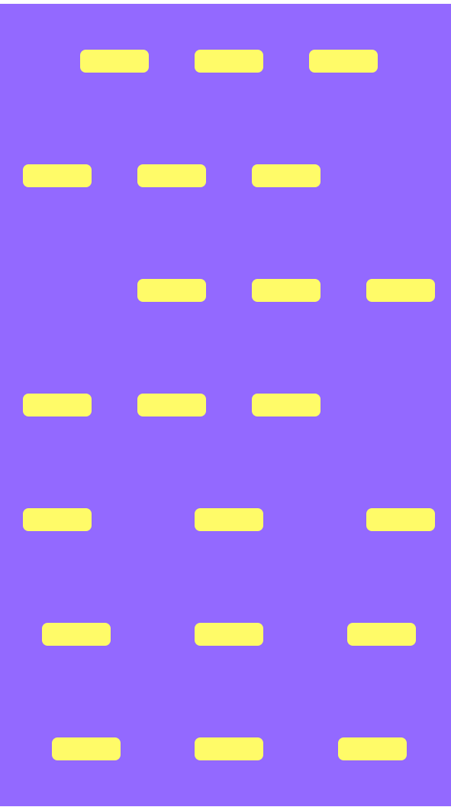

# flex布局

## flex布局属性

### html
```html
<!-- center -->
<div class="parent-center">
    <div class="child-center"></div>
    <div class="child-center"></div>
    <div class="child-center"></div>
</div>
<!-- flex-start -->
<div class="parent-start">
    <div class="child-start"></div>
    <div class="child-start"></div>
    <div class="child-start"></div>
</div>
<!-- flex-end -->
<div class="parent-end">
    <div class="child-end"></div>
    <div class="child-end"></div>
    <div class="child-end"></div>
</div>
<!-- stretch -->
<div class="parent-stretch">
    <div class="child-stretch"></div>
    <div class="child-stretch"></div>
    <div class="child-stretch"></div>
</div>
<!-- parent-space-between -->
<div class="parent-space-between">
    <div class="child-space-between"></div>
    <div class="child-space-between"></div>
    <div class="child-space-between"></div>
</div>
<!-- space-around -->
<div class="parent-space-around">
    <div class="child-space-around"></div>
    <div class="child-space-around"></div>
    <div class="child-space-around"></div>
</div>
<!-- space-evenly -->
<div class="parent-space-evenly">
    <div class="child-space-evenly"></div>
    <div class="child-space-evenly"></div>
    <div class="child-space-evenly"></div>
</div>
```
### css
```css
/* center */
.parent-center {
    display: flex;
    justify-content: center;
    align-items: center;
    background-color: #9369ff;
    width: 400px;
    height: 100px;
}
.child-center {
    width: 60px;
    background-color: #fffb68;
    height: 20px;
    margin: 0 20px;
    border-radius: 5px;
}
/* flex-start */
.parent-start {
    display: flex;
    justify-content: flex-start;
    align-items: center;
    background-color: #9369ff;
    width: 400px;
    height: 100px;
}
.child-start {
    width: 60px;
    background-color: #fffb68;
    height: 20px;
    margin: 0 20px;
    border-radius: 5px;
}
/* flex-end */
.parent-end {
    display: flex;
    justify-content: flex-end;
    align-items: center;
    background-color: #9369ff;
    width: 400px;
    height: 100px;
}
.child-end {
    width: 60px;
    background-color: #fffb68;
    height: 20px;
    margin: 0 20px;
    border-radius: 5px;
}
/* stretch */
.parent-stretch {
    display: flex;
    justify-content: stretch;
    align-items: center;
    background-color: #9369ff;
    width: 400px;
    height: 100px;
}
.child-stretch {
    background-color: #fffb68;
    min-width: 60px;
    height: 20px;
    margin: 0 20px;
    border-radius: 5px;
}
/* space-between */
.parent-space-between {
    display: flex;
    justify-content: space-between;
    align-items: center;
    background-color: #9369ff;
    width: 400px;
    height: 100px;
}
.child-space-between {
    background-color: #fffb68;
    min-width: 60px;
    height: 20px;
    margin: 0 20px;
    border-radius: 5px;
}
/* space-around */
.parent-space-around {
    display: flex;
    justify-content: space-around;
    align-items: center;
    background-color: #9369ff;
    width: 400px;
    height: 100px;
}
.child-space-around {
    background-color: #fffb68;
    min-width: 60px;
    height: 20px;
    margin: 0 20px;
    border-radius: 5px;
}
/* space-evenly */
.parent-space-evenly {
    display: flex;
    justify-content: space-evenly;
    align-items: center;
    background-color: #9369ff;
    width: 400px;
    height: 100px;
}
.child-space-evenly {
    background-color: #fffb68;
    min-width: 60px;
    height: 20px;
    margin: 0 20px;
    border-radius: 5px;
}
```
## 效果

