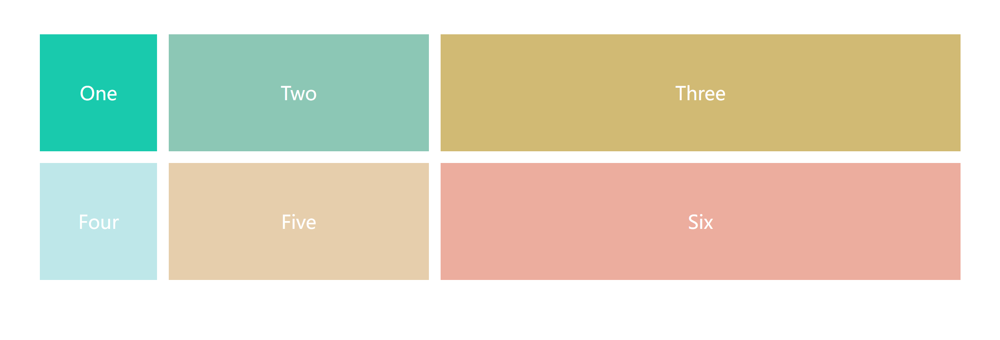

# grid网格布局

## 什么是网格布局
    Grid 布局即网格布局，是一个二维的布局方式，与 Flex 不同的是 Flex 是一维布局，
    而 Grid 由纵横相交的两组网格线形成的框架性布局结构，能够同时处理行与列，擅长将一个页面划分为几个主要区域，
    以及定义这些区域的大小、位置、层次等关系。
    Grid布局是将容器划分成“行”和“列”，产生单元格，然后指定“项目所在”的单元格。适合固定不需要动态改变的布局方式。
    设置display:grid/inline-grid的元素就是网格布局容器，这样就能出发浏览器渲染引擎的网格布局算法
   
## 网格布局的属性：
    1.容器（container） 有容器属性
    2.项目（item） 有项目属性
    3.行（row）
    4.列（column）
    5.间距（gap） 单元格之间的距离
    6.区域（area） 自己划分每个单元格占据的区域
    7.内容（content）

```html
<div class="wrapper">
    <div class="one item">One</div>
    <div class="two item">Two</div>
    <div class="three item">Three</div>
    <div class="four item">Four</div>
    <div class="five item">Five</div>
    <div class="six item">Six</div>
</div>
```
```css
.wrapper {
    /* 
    repeat() 函数：可以简化重复的值。该函数接受两个参数，第一个参数是重复的次数，第二个参数是所要重复的值
    关键字：
    auto-fill 关键字：表示自动填充，让一行（或者一列）中尽可能的容纳更多的单元格。
    grid-template-columns: repeat(auto-fill, 200px) 表示列宽是 200 px，但列的数量是不固定的，
    只要浏览器能够容纳得下，就可以放置元素

    fr 关键字：Grid 布局还引入了一个另外的长度单位来帮助我们创建灵活的网格轨道。fr 单位代表网格容器中可用空间的一等份。
    grid-template-columns: 200px 1fr 2fr 表示第一个列宽设置为 200px，后面剩余的宽度分为两部分，宽度分别为剩余宽度的 1/3 和 2/3

    */
    margin: 60px;
    /* 声明一个容器 */
    display: grid;
    /*  声明列的宽度  3列 每列width 200px */
    /* grid-template-columns: repeat(3, 200px); */
    /* grid-template-columns: 200px 200px 200px; */
    /* grid-template-columns: repeat(auto-fill, 200px); */
    grid-template-columns: 200px 1fr 2fr;
    /*  声明行间距和列间距  */
    grid-gap: 20px;
    /*  声明行的高度height 参数：第一行高度 第二行高度 */
    grid-template-rows: repeat(2,200px);
    /* grid-template-rows: 200px 200px; */
}

.one {
    background: #19CAAD;
}

.two {
    background: #8CC7B5;
}

.three {
    background: #D1BA74;
}

.four {
    background: #BEE7E9;
}

.five {
    background: #E6CEAC;
}

.six {
    background: #ECAD9E;
}

.item {
    text-align: center;
    font-size: 200%;
    line-height: 200px;
    color: #fff;
}
```
## 效果



    